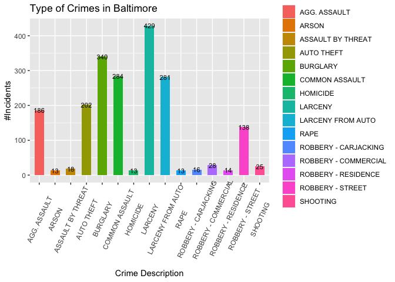
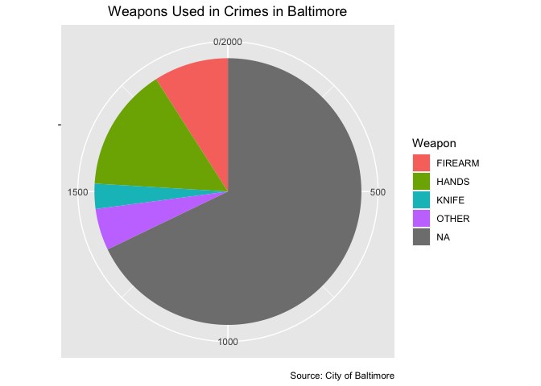
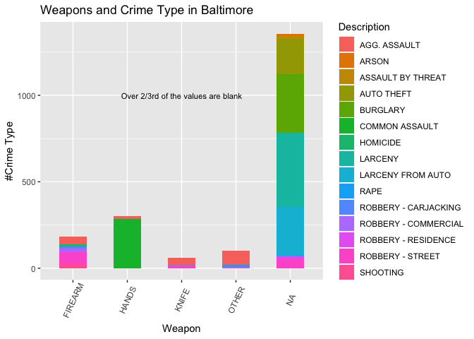
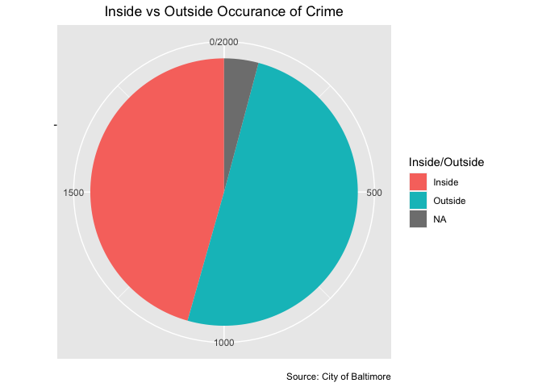
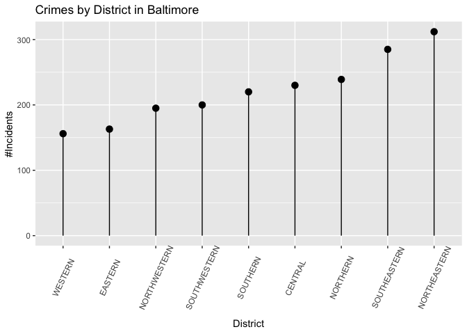
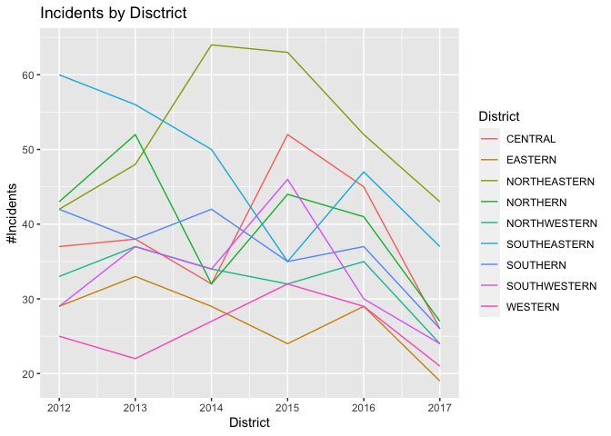
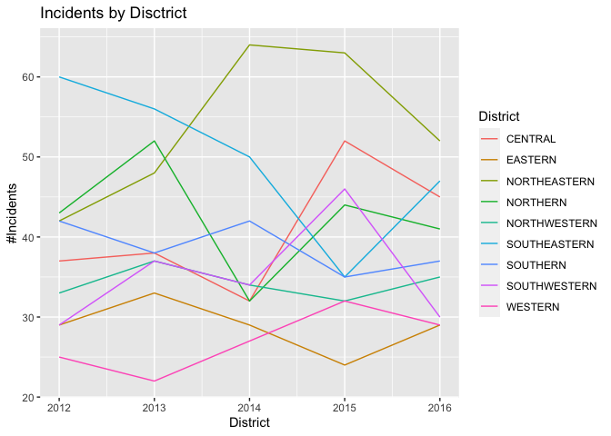
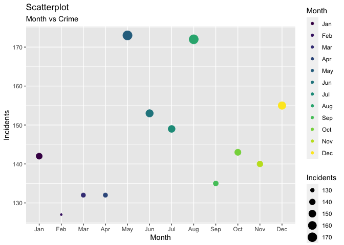
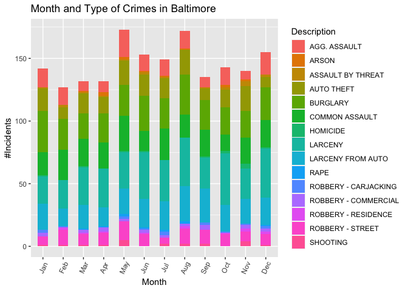

Problem Set 3
================
Nithya Vembu
7/14/2018

# Crimes in Baltimore

    ## 
    ##   There is a binary version available but the source version is
    ##   later:
    ##         binary source needs_compilation
    ## ggplot2  3.3.0  3.3.3             FALSE

    ## installing the source package 'ggplot2'

    ## 
    ##   There is a binary version available but the source version is
    ##   later:
    ##       binary source needs_compilation
    ## dplyr  0.8.5  1.0.4              TRUE

    ## installing the source package 'dplyr'

    ## 
    ## Attaching package: 'dplyr'

    ## The following objects are masked from 'package:stats':
    ## 
    ##     filter, lag

    ## The following objects are masked from 'package:base':
    ## 
    ##     intersect, setdiff, setequal, union

    ## [1] 0

    ##  [1] STREET     APT/CONDO  GAS STATIO            ROW/TOWNHO OTHER - IN
    ##  [7] CONSTRUCTI HOSP/NURS. UNKNOWN    YARD       APARTMENT  Street    
    ## [13] GARAGE ON  PORCH/DECK PUBLIC BUI BAR        Parking Lo TAVERN/NIG
    ## [19] PARKING LO HOTEL/MOTE CONVENIENC ALLEY      SCHOOL     DRIVEWAY  
    ## [25] SHED/GARAG GROCERY/CO RESTAURANT OTHER/RESI CLUB HOUSE RETAIL/SMA
    ## [31] SUBWAY     SINGLE HOU DEPARTMENT SPECIALTY  Alley      OTHER - OU
    ## [37] BLDG UNDER PUBLIC HOU Common Bus VACANT BUI HARDWARE/B RACE TRACK
    ## [43] BUS/RAILRO CARRY OUT  RELIGIOUS  CAR LOT-NE Public Are DRUG STORE
    ## [49] Dwelling   MARKET STA PARK       Vacant Dwe DOCTORS OF BUS/AUTO  
    ## [55] CONVENTION BUS. PARK  CLOTHING/S FIRE DEPAR OFFICE BUI AUTO PARTS
    ## [61] PENITENTIA WHOLESALE/ POLICE DEP LIQUOR STO LAUNDRY/CL BAKERY    
    ## [67] STADIUM    CAR  REPAI BUS.  STOR YARD/BUSIN LIGHT RAIL Hospital  
    ## [73] COURT HOUS Public Sch BARBER/BEA SHOPPING M RECREATION POOL/BOWLI
    ## 124 Levels:  Alley ALLEY APARTMENT APT. LOCKE APT/CONDO ... YARD/BUSIN

\#\#1 The histogram below reveals the most prevalant types of crimes in
Baltimore in the sample data. It can be noted that unlawful
appriopriation of others’ property in forms of auto theft, burglary,
larceny, larceny from auto and various forms of robbery accounts for
majority of the crimes. This is followed by assaults (aggravated and by
threat).

<!-- -->

\#\#2 Examining the types of weapons used shows that hands and firearms
were the top two types. While less than a third of the crimes in the
sample crime data involved weapons, the rest used no weapons or perhaps
the data was missing.

<!-- -->

\#\#3 Taking a closer look at how what kind of weapons were associated
with the different descriptions of crime, reveals that the majority of
most prevalant crimes had no value associated with it. If the blank
values all mean “no weapon”, then we are able to say that majority of
the crimes do not involve weapons. However, if the blank values also
mean that data was missing or the exact weapon was not known, then such
a conclusion would be false. When it comes to known weapons, hands are
widely used in assault, and firearms for different robberies and
shooting.

<!-- -->
\#\#4 Next, in plotting where the crime happened (Inside vs Outside), it
was seen that ‘Outside’ is represented by both the values “Outside” and
“O”. Similarly, “Inside” is represented by both “Inside” and “I”.

In order to standardize the values, the “O”s were changed to “Outside”,
and “I”s to “Inside”. The pie chart of the recoded variable, tells us
that crime occurs more outside, than inside.

<!-- -->

\#\#5 In order to easily visualize if one or more districts are high on
crime, this ranked lollipop chart was created. The mean value of the
crime incidents by neighborhood was found to be 223. The top crime
districts with above average number of incidents were found to be North
Eastern, South Eastern, Northern and Central.

    ## [1] 222.2222

<!-- -->

Before analyzing how these different factors influence one another, the
CrimeDate and CrimeTime variables are examined. For this the date and
time values are formatted.

    ## 
    ##   There is a binary version available but the source version is
    ##   later:
    ##           binary  source needs_compilation
    ## lubridate  1.7.4 1.7.9.2              TRUE

    ## installing the source package 'lubridate'

    ## 
    ## Attaching package: 'lubridate'

    ## The following objects are masked from 'package:base':
    ## 
    ##     date, intersect, setdiff, union

\#\#6 The reformatting helps figure out whether crime has risen in the
periods when this data was collected, and this is broken down by
district. Majority of the districts have similar patterns for a given
year. The plot below shows that in 2017, in all districts, the number of
incidents has reduced. However, when taking a closer look at the data
itself, we find that there is no data available after September 1st
2017. This could be the reason for this trend. Apart from that data, the
overall crime has an alternating up and down pattern. If the sample is a
precise representation of the whole dataset, it is worth analyzing the
social, economic, etc, factors in Baltimore in the years with lower
crime.

    ## # A tibble: 6 x 2
    ##   `df$CrimeYear`     n
    ## *          <dbl> <int>
    ## 1           2012   340
    ## 2           2013   361
    ## 3           2014   344
    ## 4           2015   363
    ## 5           2016   345
    ## 6           2017   247

    ## [1] "2012-01-01"

    ## [1] "2017-09-01"

<!-- --><!-- -->

\#\#7 To determine if the number of criminal incidents is high at some
months of the year, the plot below was created. The first plot created
had very low values for months September-December. Keeping in mind that
this could be the result of unavailability of data for 2017 Sep-Dec, the
data for 2017 was removed from the analysis. The resulting plot revealed
that crime incidents are particularly high during the summer months of
May-August. Taking a further look at the type of incidents, might reveal
more clues on why this pattern exists.

<!-- -->

\#\#8 The 2017 data was still omitted, and the distribution of the types
of crimes over the different months was created. The distribution of the
types of crime around the months seem uniform, with more number of
incidents in the summer, and some winter months than the rest.

<!-- -->
